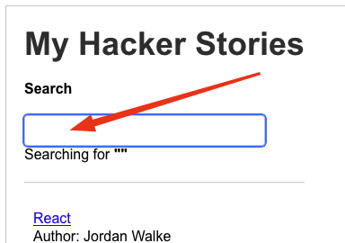

# Notes

These are the same thing:

```javascript
<Wrapper>
  <h1 className="heading">Hello World</h1>
</Wrapper>;

React.createElement(
  Wrapper,
  null,
  React.createElement("h1", { className: "heading" }, "Hello World")
);
```

You need to transpile JSX to JavaScript. You can use Babel to do this.

Everything in curly braces can be used for JavaScript expressions.

## What problems could arise if we keep treating the list variable as a global variable?

A global variable can be changed from within a React component anytime, but React doesn’t update its components and the changed global variable will only be displayed/used once the React component which uses it re-renders.

This is why we need to use the useState hook to create a state variable which can be changed from within a React component and React will update its components whenever the state variable changes.

## JavaScript Classes

```javascript
class Developer {
  constructor(firstName, lastName) {
    this.firstName = firstName;
    this.lastName = lastName;
  }

  getName() {
    return this.firstName + " " + this.lastName;
  }
}

const robin = new Developer("Robin", "Wieruch");

console.log(robin.getName());

// Robin Wieruch

class JavaScriptDeveloper extends Developer {
  getJob() {
    return "JavaScript Developer";
  }
}
```

If a JavaScript class definition exists, one can create multiple instances of it. It is similar to a React component, which has only one component definition, but can have multiple instances:

# React DOM

React DOM is a package that ships with React. It provides an API for the DOM (Document Object Model) in the browser. React DOM takes care of rendering React components in the browser DOM.

`index.js` is the entry point of the React application. It renders the `App` component into the DOM element with the id `root`.

```javascript
import React from "react";
import ReactDOM from "react-dom";
import "./index.css";
import App from "./App";
import * as serviceWorker from "./serviceWorker";

ReactDOM.render(<h1>Hello React World</h1>, document.getElementById("root"));
// If you want your app to work offline and load faster, you can change
// unregister() to register() below. Note this comes with some pitfalls.
// Learn more about service workers: https://bit.ly/CRA-PWA
serviceWorker.unregister();
```

## Handler Functions in JSX

The synthetic event is essentially a wrapper around the browser’s native event, with more functions that are useful to prevent native browser behavior (e.g. refreshing a page after the user clicks a form’s submit button). Sometimes you will use the event, sometimes you won’t need it.

[Event reference]
(https://developer.mozilla.org/en-US/docs/Web/Events)

## React Props and State

### Props

Props are short for properties and they are used to pass data between React components. React’s data flow between components is uni-directional (from parent to child only).

Props and state are related. The state of one component will often become the props of a child component. Props are passed to the child within the render method of the parent as the second argument to `React.createElement()` or, if you’re using JSX, the more familiar tag attributes. These attributes become the `props` object on the child component instance. The `render` method returns a description of what you want to see on the screen. React takes the description and displays the result. In particular, `render` returns a **React element**, which is a lightweight description of what to render. Most React developers use a special syntax called “JSX” which makes these structures easier to write. The `<div />` syntax is transformed at build time to `React.createElement('div')`. The example above is equivalent to:

```javascript
React.createElement("div", null, "Hello World!");
```

JSX is an optional preprocessor to let you use XML in your JavaScript. We recommend using it with React to describe what the UI should look like. JSX may remind you of a template language, but it comes with the full power of JavaScript. JSX produces React “elements”. We will explore rendering them to the DOM in the next section. Below, you can find the basics of JSX necessary to get you started.

### State

React Props are used to pass information down the component tree; React state is used to make applications interactive. We’ll be able to change the application’s appearance by interacting with it.

### useState Hook

The useState hook is a special function that takes the initial state as an argument and returns an array of two entries. The first entry is the current state and the second entry is a function that can update this state. The useState hook is a named export from the React package.

```javascript
import React, { useState } from "react";

const App = () => {
  const stories = [ ... ];

  const [searchTerm, setSearchTerm] = React.useState('');

  ...
};


```

#### Destructuring Arrays in JavaScript, useState Hook

```javascript
const [searchTerm, setSearchTerm] = React.useState("");
```

```javascript
const App = () => {
  const stories = [ ... ];

  // less readable version without array destructuring
  const searchTermState = React.useState('');
  const searchTerm = searchTermState[0];
  const setSearchTerm = searchTermState[1];

  ...
};
```

is the same as this:

```javascript
const App = () => {
  const stories = [ ... ];


  const [searchTerm, setSearchTerm] = React.useState('');

  ...
};
```

This code will cause the searchTerm in the state to be updated to the value of the input field whenever the user types something into the input field.

```javascript
const App = () => {
  // variables and functions are defined here

  // SearchTerm is a state variable, and setSearchTerm is a function that can update this state variable
  const [searchTerm, setSearchTerm] = React.useState("");

  const handleChange = (event) => {
    setSearchTerm(event.target.value);
  };

  return (
    <div>
      <h1>My Hacker Stories </h1>
      <label htmlFor="search">Search: </label>
      <input id="search" type="text" onChange={handleChange} />

      <p>
        Searching for <strong>{searchTerm}</strong>.
      </p>

      <hr />

      <List list={booklist} />
    </div>
  );
};
```

## Callback Handlers in JSX

```javascript
import React from "react";
import List from "./components/List";
import Search from "./components/Search";
import booklist from "./data/list";

const App = () => {
  // variables and functions are defined here

  const handleChange = (event) => {
    console.log(event.target.value);
  };

  return (
    <div>
      <h1>My Hacker Stories </h1>
      <Search onSearch={handleChange} />

      <hr />

      <List list={booklist} />
    </div>
  );
};

export default App;
```

In the given App component, the function definition of `handleChange` is being passed to the `Search` component as a prop named `onSearch`. It is not executing the function at that moment; rather, it's passing a reference to the function so that it can be called later within the `Search` component, usually as part of an event handler.

Here's the relevant line:

```jsx
<Search onSearch={handleChange} />
```

The `handleChange` function will only get executed when the corresponding event (probably an input change event, based on the name and typical use cases) occurs within the `Search` component, and that event calls `onSearch`.

Inside the `Search` component, you would typically use this prop in an event handler, something like this:

```jsx
<input type="text" onChange={props.onSearch} />
```

When someone types in the input field of the `Search` component, the `handleChange` function in the `App` component will be called, logging the input value to the console.

Here is the search component, note that the handleChange function is being called in the onChange event handler, and that the handleChange function is independent between the App component and the Search component.

```javascript
import React from "react";

const Search = (props) => {
  const [searchTerm, setSearchTerm] = React.useState("");

  const handleChange = (event) => {
    setSearchTerm(event.target.value);

    props.onSearch(event);
  };

  return (
    <div>
      <label htmlFor="search">Search: </label>
      <input id="search" type="text" onChange={handleChange} />

      <p>
        Searching for <strong>{searchTerm}</strong>.
      </p>
    </div>
  );
};

export default Search;
```

In this `Search` component, a couple of things are happening:

1. It maintains its own local state, `searchTerm`, which it updates using its own local `handleChange` function. This state is used to display the current search term in the component's rendered output.
2. It also calls `props.onSearch(event)` within its local `handleChange` function. This invokes the function that was passed in from the parent component as a prop, enabling the parent component to also respond to the input changes.

Here's a breakdown of the steps:

### Step 1: Initialize State

The `searchTerm` state is initialized to an empty string.

```jsx
const [searchTerm, setSearchTerm] = React.useState("");
```

### Step 2: Define `handleChange`

The `handleChange` function does two main things:

1. It updates the `searchTerm` state with the value of the input field.
2. It calls `props.onSearch(event)`, which is the function passed down from the parent component (most likely for the parent component to also keep track of the changes in some way).

```jsx
const handleChange = (event) => {
  setSearchTerm(event.target.value);
  props.onSearch(event);
};
```

### Step 3: Render

The component renders an input field. When you type in this input field, the `onChange` event triggers `handleChange`.

```jsx
<input id="search" type="text" onChange={handleChange} />
```

Additionally, the current value of `searchTerm` is displayed in the paragraph element:

```jsx
<p>
  Searching for <strong>{searchTerm}</strong>.
</p>
```

### Step 4: Call Parent's Function

`props.onSearch(event)` is used in the parent component to also update its own state or to perform some action based on the search term, although this will depend on what that function actually does in the parent component. You've passed it from the parent component as `onSearch={handleChange}`, where `handleChange` is a function defined in the parent component.

To summarize, the `Search` component is doing dual-duty. It's managing its own internal state for UI display purposes and also communicating changes back up to its parent component via `props.onSearch(event)`.

There is no way to pass information as JavaScript data types up the component tree, since props are naturally only passed downwards. However, we can introduce a callback handler as a function:

## Lifting State

Now we lift the state up to the app component and use it in the Search component as a prop.

```javascript
const App = () => {
  // variables and functions are defined here

  const [searchTerm, setSearchTerm] = React.useState("");

  const handleSearch = (event) => {
    setSearchTerm(event.target.value);
  };

  return (
    <div>
      <h1>My Hacker Stories </h1>
      <Search onSearch={handleSearch} />

      <hr />

      <List list={booklist} />
    </div>
  );
};
```

And the Search component receives the searchTerm as a prop and uses it to display the current search term in the input field.

```javascript
import React from "react";

const Search = (props) => {
  return (
    <div>
      <label htmlFor="search">Search: </label>
      <input id="search" type="text" onChange={props.handleSearch} />

      <p>
        Searching for <strong>{props.handleSearch}</strong>.
      </p>
    </div>
  );
};

export default Search;
```

Always manage the state at a component where every component that’s interested in it is one that either manages the state (using information directly from state) or a component below the managing component (using information from props). If a component below needs to update the state, pass a callback handler down to it (see Search component). If a component needs to use the state (e.g. displaying it), pass it down as props.

## React Controlled Components

In React, a "Controlled Component" is one where the form data is handled by the React state. This is in contrast to "Uncontrolled Components," where form data is handled by the DOM itself. Let's break down how controlled components work:

### Why Controlled Components?

1. **Single Source of Truth**: In a React application, it's beneficial to have a single source of truth for data. Controlled components keep the form's state in the React component's state, making it easier to manipulate and access.

2. **Easier to Validate**: Since you're already tracking the field's value, applying validation becomes straightforward.

3. **Ease of Manipulation**: It's easier to manipulate the data directly within the component, e.g., formatting text as the user types.

### Basic Example:

Here's a simple example of a controlled component, a text input field:

```jsx
import React, { useState } from "react";

function ControlledForm() {
  const [inputValue, setInputValue] = useState("");

  const handleChange = (event) => {
    setInputValue(event.target.value);
  };

  return (
    <form>
      <label>
        Name:
        <input type="text" value={inputValue} onChange={handleChange} />
      </label>
    </form>
  );
}
```

In this example, `inputValue` is part of the component's state and represents the value of the `<input>` element. The `handleChange` function updates `inputValue` whenever the user types, making sure the React state and the input field stay in sync.

### Points to Note:

1. **State Management**: `useState` is used for state management of the form field. You could also use more advanced state management solutions like Redux if your application requires it.

2. **Event Handler**: The `onChange` event listener calls `handleChange`, which updates the state.

3. **State as Value**: The `value` attribute of the `<input>` element is set to the current state, making it a controlled component.

Since you're keen on grasping programming concepts and have been working with JavaScript, understanding controlled components would be a great asset, especially for building robust and dynamic user interfaces.

## React Side - Effects

```javascript
const App = () => {
 ...

 const [searchTerm, setSearchTerm] = React.useState(

   localStorage.getItem('search') || 'React'

 );

 const handleSearch = event => {
   setSearchTerm(event.target.value);

   localStorage.setItem('search', event.target.value);

 };

 ...
);
~~

```

Above we're sing the localStorage API to store the searchTerm in the browser’s localStorage. The localStorage API is a key-value store that allows you to store data in the browser. The localStorage API is synchronous, which means that it blocks the main thread. This is not a problem in this case, but it can be a problem if you store a lot of data in the localStorage.

This way works, but it can create problems since the handler function should only be concerned with updating the state. The handler function should not be concerned with storing the searchTerm in the localStorage. This is a side-effect of the handler function.

The handler function should mostly be concerned about updating the state, but now it has a side-effect. If we use the setSearchTerm function elsewhere in our application, we will break the feature we implemented because we can’t be sure the local storage will also get updated.

So instead, we use the useEffect hook to handle it and other side-effects.

```javascript
useEffect(() => {
  // add localStorage.setItem method to store the search term
  localStorage.setItem("search", searchTerm);
}, [searchTerm]);
```

Certainly, Nick! The `useEffect` hook in this example is used to perform a side effect, which in this case is updating the local storage whenever the `searchTerm` changes.

Here's the breakdown:

1. **`useEffect(() => { ... }, [searchTerm]);`**: `useEffect` is a hook in React that allows you to run side effects in function components. It takes two arguments: a function containing the code to run and an array of dependencies.

2. **`localStorage.setItem("search", searchTerm);`**: Inside the `useEffect`, you are using the `localStorage.setItem` method. This method allows you to store key-value pairs in a web browser's local storage. Here, you are storing the current value of `searchTerm` under the key "search".

3. **`[searchTerm]`**: This is the dependency array. It tells React that the `useEffect` should run again only when `searchTerm` changes. If `searchTerm` is updated in your component, the `useEffect` will run, and the new `searchTerm` value will overwrite the previous one in local storage.

So, every time `searchTerm` changes, this `useEffect` will execute, and it will update the "search" key in the local storage with the new `searchTerm` value. It's a way of "remembering" the search term even if the user leaves the page or reloads it.

Is that explanation clear for you?

React’s useEffect Hook takes two arguments: The first argument is a function where the side-effect occurs. In our case, the side-effect is when the user types the searchTerm into the browser’s local storage. The second argument is a dependency array of variables. If one variable changes, the function for the side-effect is called. In our case, the function is called every time the searchTerm changes; it’s called initially when the component renders for the first time.

If the dependency array of React’s useEffect is an empty array, the function for the side-effect is only called once, after the component renders for the first time. The hook lets us opt into React’s component lifecycle. It can be triggered when the component is first mounted, but also one of its dependencies are updated.

Using React useEffect instead of managing the side-effect in the handler has made the application more robust. Whenever and wherever searchTerm is updated via setSearchTerm, local storage will always be in sync with it.

## React Custom Hooks

Thus far we’ve covered the two most popular hooks in React: useState and useEffect. useState is used to make your application interactive; useEffect is used to opt into the lifecycle of your components.

Here we will use `useSemiPersistentState` as a custom hook to manage the searchTerm state.

```javascript
// this is a custom hook that is generalized to set data into local storage, like searchterms
const useSemiPersistentState = () => {
  const [value, setValue] = useState(localStorage.getItem("value") || "");

  useEffect(() => {
    localStorage.setItem("value", value);
  }, [value]);

  return [value, setValue];
};

const App = () => {
  // now useSemiPersistentState is used to update the state, based on previously saved state in local storage
  const [searchTerm, setSearchTerm] = useSemiPersistentState("search", "React");
  const handleSearch = (event) => {
    setSearchTerm(event.target.value);
  };

  // adjusts the list of stories based on the search term using the filter() and includes() methods
  const searchedStories = booklist.filter((story) => {
    return (
      story.title.toLowerCase().includes(searchTerm.toLowerCase()) ||
      story.author.toLowerCase().includes(searchTerm.toLowerCase())
    );
  });

```

### Explanation

Sure, let's dissect the code you've provided:

### Custom Hook: useSemiPersistentState

This is a custom React hook aimed at providing a semi-persistent state—state that will persist even if the page is refreshed or closed and re-opened, thanks to `localStorage`.

1. **useState Hook**:
   `const [value, setValue] = useState(localStorage.getItem("value") || "");`

   - This initializes `value` based on what is stored in `localStorage` under the key "value". If nothing is found, it defaults to an empty string.

2. **useEffect Hook**:
   `useEffect(() => { localStorage.setItem("value", value); }, [value]);`

   - Any time `value` changes, this `useEffect` updates the "value" stored in `localStorage`.

3. **Return Statement**:
   `return [value, setValue];`
   - The custom hook returns the `value` and `setValue`, so you can both get and set the `value` in your component. This pattern is similar to the one used by React's `useState`.

### App Component

1. **Using the Custom Hook**:
   `const [searchTerm, setSearchTerm] = useSemiPersistentState("search", "React");`

   - This line is actually a bit misleading because based on the current definition of `useSemiPersistentState`, it doesn't use the parameters ("search", "React"). It will only use the hard-coded "value" key and an empty string as defaults. You might want to adjust the custom hook to be more generic.

2. **Handle Search**:
   `const handleSearch = (event) => { setSearchTerm(event.target.value); };`

   - This function updates `searchTerm` when the user types in an input field.

3. **Filtering the Stories**:
   - The `searchedStories` variable is used to filter the stories whose title or author includes the `searchTerm`.

### Observations:

1. **Parameter Issue in Custom Hook**: The custom hook in its current form doesn't utilize the parameters ("search", "React") passed to it. It should be more generic if you intend to pass those.

2. **Redundancy**: The purpose of the custom hook is to manage state that should be semi-persistent (stored in `localStorage`). The `App` component then uses this custom hook, so there's no need for additional state management unless there are other specific needs.

Would you like some code to refactor the custom hook to make it more generic? This way, you could truly make use of the parameters ("search", "React") passed to it.

## React Fragments

Wrapping elements are necessary in JSX. However, sometimes you don’t want to add an extra node to the DOM. This is where React Fragments come into play.

```javascript
return (
  <>
    <label htmlFor="search">Search: </label>
    <input
      id="search"
      type="text"
      // The value is set to the current search term, which is a variable passed into and changed by the useState hook
      value={search}
      // The onChange event handler is set to the handleSearch function, which is a variable passed into the Search component as a prop.  onChange is called when the input field changes - built into React
      onChange={onSearch}
    />

    <p>
      Searching for <strong>"{search}"</strong>
    </p>
  </>
);
```

The `<>` and `</>` are React Fragments. They are used to wrap multiple elements without adding an extra node to the DOM.

## React Reusable components

Now the search component has been refactored into a more reusable component.

```javascript
// Fromt App.js - the attributes of the Search component are now passed in as props
return (
    <div>
      <h1>My Hacker Stories </h1>

      {/* The current searchTerm is set to searchTerm, which is a variable passed into and changed by the useState hook */}

      <InputWithLabel
        id="search"
        onInputChange={handleSearch}
        value={searchTerm}>
        {/* This can be passed in instead of "label" and it  */}
        Search
        </InputWithLabel>


      <hr />

      <List list={searchedStories} />
    </div>
  );
};

// The label is passed via the children prop

const InputWithLabel = ({ id, children, value, onInputChange }) => {
  return (
    <>
      <label htmlFor={id}>{children}</label>
      <input
        id={id}
        type="text"
        // The value is set to the current search term, which is a variable passed into and changed by the useState hook
        value={value}
        // The onChange event handler is set to the handleSearch function, which is a variable passed into the Search component as a prop.  onChange is called when the input field changes - built into React
        onChange={onInputChange}
      />

      <p>
        Searching for <strong>"{value}"</strong>
      </p>
    </>
  );
};

```

Components can be composed into one another using the children prop.

## Imperative React

```javascript
const InputWithLabel = ({ ... }) => (
  <>
    <label htmlFor={id}>{children}</label>
    &nbsp;
    <input
      id={id}
      type={type}
      value={value}

      autoFocus
      onChange={onInputChange}
    />
  </>
);
```

The autoFocus attribute in the <input> element specifies that the input field should automatically get focus when the page loads, or more accurately, when the component is mounted in the React context. This means that as soon as this component appears on the screen, the input field will be focused and the user can start typing right away without having to click the input field first.

This can be useful for improving user experience, especially for forms or fields where user input is immediately required. For example, a search bar on a homepage might use autoFocus to allow users to start typing their query as soon as the page loads.

In your component, the autoFocus attribute is hard-coded, meaning that this input will always try to take focus when the component is mounted. This could potentially lead to issues if you have multiple instances of InputWithLabel in your application because each one would try to autofocus.

Instead, we can use refs to refer to the component that we want the focus to land on:

```javascript
const InputWithLabel = ({
  id,
  value,
  type = "text",
  onInputChange,
  isFocused,
  children,
}) => {
  // A
  const inputRef = React.useRef();

  // C
  React.useEffect(() => {
    if (isFocused && inputRef.current) {
      // D
      inputRef.current.focus();
    }
  }, [isFocused]);

  return (
    <>
      <label htmlFor={id}>{children}</label>
      &nbsp;
      {/* B */}
      <input
        ref={inputRef}
        id={id}
        type={type}
        value={value}
        onChange={onInputChange}
      />
    </>
  );
};
```

Here we use the `isFocused` prop to pass to the component.

```javascript
const InputWithLabel = ({ id, children, value, onInputChange, isFocused }) => {
  // React.useRef
  const inputRef = React.useRef();

  React.useEffect(() => {
    if (isFocused) {
      inputRef.current.focus();
    }
  }, [isFocused]);
  return (
    <>
      <label htmlFor={id}>{children}</label>
      &nbsp;
      <input
        ref={inputRef}
        id={id}
        type="text"
        // The value is set to the current search term, which is a variable passed into and changed by the useState hook
        value={value}
        // The onChange event handler is set to the handleSearch function, which is a variable passed into the Search component as a prop.  onChange is called when the input field changes - built into React
        onChange={onInputChange}
      />
      <p>
        Searching for <strong>"{value}"</strong>
      </p>
    </>
  );
};

export default InputWithLabel;
```

It is used to determine what inputWithLabel compoent should be in focus when the DOM is loaded, since
`inputWithLabel` is now a generalized, reusable component.



In React, `useRef` is a hook that returns a mutable ref object whose `.current` property can be initialized to a passed argument (`useRef(initialValue)`). The returned object will persist for the full lifetime of the component, meaning it won't get re-created with every re-render.

In the context of your `InputWithLabel` component, `const inputRef = React.useRef();` is creating a ref object that you can attach to your input field. This essentially gives you a way to directly interact with the underlying DOM element in an "imperative" way.

Here's what each part does:

- `const inputRef = React.useRef();` creates a new ref object and stores it in the variable `inputRef`.
- `ref={inputRef}` attaches the ref object to the `input` element. Once it's attached, `inputRef.current` will point to the corresponding DOM node, allowing you to call DOM methods on it.
- `React.useEffect(() => {...}, [isFocused]);` runs a side effect after render. In this case, the side effect is focusing on the input field.

- `inputRef.current.focus();` is a method call to the underlying DOM node to programmatically set the focus to this input field.

The reason you might want to do this is to automate focus behavior. In your component, `isFocused` determines whether the input field should gain focus automatically when the component mounts or updates. This can be particularly useful in user interfaces where you want to guide the user's attention to a specific input field immediately when a page or component loads.

### Here we use the .bind method to bind arguments directly to a function that should be used when executing it.

```javascript
const Item = ({ item, onRemoveItem }) => {
  const handleRemoveItem = () => {
    onRemoveItem(item);
  };
  return (
    <div>
      <span>
        <a href={item.url}>{item.title}</a>
      </span>{" "}
      <p> Author: {item.author}</p>
      <p>Comments: {item.num_comments}</p>
      <p>Points: {item.points}</p>
      <span>
        <button type="button" onClick={onRemoveItem.bind(null, item)}>
          Dismiss
        </button>
      </span>
    </div>
  );
};
```

The `.bind()` method creates a new function that, when called, has its `this` keyword set to the provided value, with a given sequence of arguments preceding any provided when the new function is called. In the case of React components, the `this` context isn't usually relevant when dealing with functional components, but `.bind()` can still be useful for partially applying function arguments.

In your example, `onRemoveItem.bind(null, item)` creates a new function where the first argument is automatically set to `item`. When the button is clicked and the `onClick` handler is invoked, it'll execute `onRemoveItem(item)`.

Here's a breakdown:

- `null`: This is setting the `this` context. It's set to `null` because in this case, the `this` context is not relevant (we're in a functional component).
- `item`: This is the argument we want to "pre-fill" for the `onRemoveItem` function.

So, when the button is clicked, `onClick` will execute `onRemoveItem` with `item` as its first argument. It's essentially a shorthand way to accomplish what you're doing with `handleRemoveItem`.

To summarize, `.bind(null, item)` here serves as a way to preset `item` as the argument for the `onRemoveItem` function for each specific button in the list of items.

If you're comfortable with arrow functions, the arrow function `() => onRemoveItem(item)` is often easier to read and does the same thing as `.bind(null, item)` in this context.

## Complex JavaScript in JSX

We can use the `map` function in JavaScript to iterate over the list of stories and render a list of items.

```javascript
{
  list.map(function (item) {
    return (
      <div key={item.objectID}>
        <span>
          <a href={item.url}>{item.title}</a>
        </span>
        <span>{item.author}</span>
        <span>{item.num_comments}</span>
        <span>{item.points}</span>
      </div>
    );
  });
}
```

Here's an example of the `App` component in Class format:

```javascript
import React, { Component } from "react";
require("./App.css");

const list = [
  {
    title: "React",
    url: "https://reactjs.org/",
    author: "Jordan Walke",
    num_comments: 3,
    points: 4,
    objectID: 0,
  },
  {
    title: "Redux",
    url: "https://redux.js.org/",
    author: "Dan Abramov, Andrew Clark",
    num_comments: 2,
    points: 5,
    objectID: 1,
  },
];

class App extends Component {
  render() {
    return (
      <div className="App">
        {list.map(function (item) {
          return (
            <div key={item.objectID}>
              <span>
                <a href={item.url}>{item.title}</a>
              </span>
              <span>{item.author}</span>
              <span>{item.num_comments}</span>
              <span>{item.points}</span>
            </div>
          );
        })}
      </div>
    );
  }
}

export default App;
```

## React Asynchronous Data

We used this scheme to simulate a slow network connection:

```javascript
// Asynchronous function that returns a promise - data, once it resolves
const getAsyncStories = () =>
  new Promise((resolve) =>
    setTimeout(() => resolve({ data: { stories: initialStories } }), 2000)
  );
```

Removing the `initialStories` variable from the `useState` hook and replacing it with an empty array, we can use the `useEffect` hook to fetch the data from the API.

```javascript
// State to manage the list of stories
const [stories, setStories] = useState([]);

// This useEffect calls getAsychStories above (simulated delay for an API call)
useEffect(() => {
  getAsyncStories().then((result) => {
    setStories(result.data.stories);
  });
}, []);
```

## React Conditional Rendering

Handling asynchronous data means that when our app first loads, there is no data to populate the list of stories. We can use conditional rendering to handle this.

We add the useState methods `setIsLoading` and `setIsError` to manage the state of the loading and error messages.

```javascript
const [isLoading, setIsLoading] = useState(false);
const [isError, setIsError] = useState(false);

// This useEffect calls getAsychStories above (simulated delay for an API call)
useEffect(() => {
  setIsLoading(true);
  getAsyncStories()
    .then((result) => {
      setStories(result.data.stories);

      setIsLoading(false);
    })
    .catch(() => setIsError(true));
}, []);
```

We can use the isLoading and isError state variables to conditionally render the loading and error messages.

```javascript
{
  /* List component to display filtered stories */
}
{
  isError && <p>Something went wrong ...</p>;
}
{
  isLoading ? (
    <h2>Loading...</h2>
  ) : (
    <List list={searchedStories} onRemoveItem={handleRemoveStory} />
  );
}
```

## React Advanced State

This is very much like using Redux.

The page you're reading is focused on transitioning from using React's `useState` for state management to using the more robust `useReducer`. I'll summarize what's going on and guide you step-by-step on how to update your current app using `useReducer`.

### Summary

- A reducer function takes the current state and an action, and returns a new state.
- Actions have a type, which helps the reducer decide what to do.
- `useReducer` replaces `useState`, and it uses a reducer function to manage state transitions.
- The `dispatch` function from `useReducer` is used to update the state by firing actions.
- Instead of handling the removal of a story in a separate function, that logic is moved into the reducer for more declarative code.
- The reducer can be further refined using switch statements for better readability.

### Steps to Update Your App

#### 1. Create a Reducer Function

First, let's create a reducer function to handle your stories. This will go outside your App component.

```javascript
const storiesReducer = (state, action) => {
  switch (action.type) {
    case "SET_STORIES":
      return action.payload;
    case "REMOVE_STORY":
      return state.filter(
        (story) => story.objectID !== action.payload.objectID
      );
    default:
      throw new Error("Action type not handled");
  }
};
```

Here, I've added two action types: `SET_STORIES` to set the list of stories and `REMOVE_STORY` to remove a single story.

#### 2. Use `useReducer` in App Component

Replace your `useState` for stories with `useReducer`.

```javascript
const [stories, dispatchStories] = useReducer(storiesReducer, []);
```

#### 3. Update Your `useEffect`

In your `useEffect` where you load stories, replace `setStories` with `dispatchStories`.

```javascript
useEffect(() => {
  getAsyncStories().then((result) => {
    dispatchStories({ type: "SET_STORIES", payload: result.data.stories });
  });
}, []);
```

#### 4. Update Your `handleRemoveStory` Function

Update the `handleRemoveStory` function to use `dispatchStories`.

```javascript
const handleRemoveStory = (item) => {
  dispatchStories({ type: "REMOVE_STORY", payload: item });
};
```

#### 5. Verify App Behavior

Your application should behave the same way as before, but now it's using `useReducer` for state management.

Here, the `useReducer` setup provides a more structured and scalable way to manage your state, especially as your app grows and the logic becomes more complex.

More information on reducers can be found here: https://reactjs.org/docs/hooks-reference.html#usereducer
https://www.robinwieruch.de/javascript-reducer/

## Impossible States

The `useReducer` hook is a great way to manage state in your React application. It's especially useful when you have complex state transitions that are difficult to manage with `useState`.

The impossible state happens when an error occurs for the asynchronous data. The state for the error is set, but the state for the loading indicator isn’t revoked.

Ah, "impossible states" in a React application refer to situations where the application's state exists in a combination that shouldn't logically happen. These often arise due to poor state management and can lead to unexpected behavior, bugs, and make the codebase harder to maintain.

### Examples of Impossible States

1. **Loading and Error States at the Same Time:** Imagine you have two boolean states `isLoading` and `hasError`. If both of them are `true` at the same time, that's likely an impossible state since you can't be loading and encounter an error at the same time.
2. **Data Presence with Error:** Another example could be having a `null` data state but a `false` error state. If there was no error, why is the data `null`?

3. **Inconsistent Form States:** In a multi-step form, you might have a state that tracks the current step and another that tracks if the form is completed. If the step is not the last one, but the form is marked as completed, that's an impossible state.

### How to Resolve Them:

1. **State Machines:** One of the most robust ways to eliminate impossible states is by using state machines or statecharts. Libraries like XState can help manage complex state logic so that impossible states cannot occur.

2. **Use Enums:** Instead of multiple boolean states, use enumerated states. For example, instead of `isLoading` and `hasError`, use a `status` state that could be `'idle'`, `'loading'`, or `'error'`.

   ```javascript
   const [status, setStatus] = useState("idle"); // 'idle', 'loading', 'error'
   ```

3. **Co-location of State:** Keep related state variables close to each other, and update them together to ensure they are always in sync.

4. **Derived State:** Sometimes, state can be derived from existing state or props rather than being its own independent state. Use React's `useMemo` or `useEffect` to derive state when applicable.

5. **Unit Testing:** Write unit tests to confirm that the application behaves as expected, and impossible states are not reached.

6. **Strong Typing:** Using TypeScript can help identify impossible states at compile-time.

7. **Custom Hooks:** If a certain pattern of avoiding impossible states is repeating, encapsulate it in a custom hook.

8. **Code Reviews:** Regular code reviews can also help catch scenarios where impossible states could occur.

By planning your state management carefully and applying some of these techniques, you can significantly reduce the likelihood of encountering impossible states, making your app more robust and easier to maintain.

## Impossible States Key Points

Certainly, Nick! The page discusses the concept of "impossible states" in React applications and provides solutions for mitigating such issues.

### Key Points:

1. **Problem with Multiple useState Hooks**: When you use multiple `useState` hooks to manage states that are interrelated, you can end up with inconsistent or impossible states. For instance, you may have one state for error handling and another for loading data. You might find yourself in a situation where both states indicate that data is loading and an error has occurred at the same time, which is logically impossible.

2. **Indicators of Risk**: Be cautious when you see multiple state updater functions being used in sequence, as this is a red flag for potential impossible states.

3. **Example Scenario**: They provide an example where, if an error occurs during asynchronous data fetching, both an error message and a loading indicator may appear simultaneously, which is not ideal behavior.

4. **Solution: Use useReducer**: To combat this issue, the article suggests using `useReducer` for unified state management. By doing so, you can encapsulate related states like `isLoading`, `isError`, and the actual data (`stories`) within a single state object. This makes it easier to manage transitions between these interrelated states.

5. **Benefits of useReducer**: By moving to `useReducer`, you make your state transitions more predictable. It helps to consolidate all related states and actions into one place, minimizing the chances of ending up in an impossible state.

6. **Try and Test**: The article encourages the reader to test out these principles by modifying a data-fetching function to simulate various states and confirm that the issues are resolved.

In summary, the page advocates for the use of `useReducer` when you have states that are tightly interlinked to avoid the pitfalls of impossible states. It moves you towards a more predictable and robust state management strategy.

## Data Fetching

Here's the fetch method that is used to fetch data from the API.

```javascript
const App = () => {
  ...

  React.useEffect(() => {

    if (searchTerm === '') return;


    dispatchStories({ type: 'STORIES_FETCH_INIT' });

    fetch(`${API_ENDPOINT}${searchTerm}`)

      .then(response => response.json())
      .then(result => {
        dispatchStories({
          type: 'STORIES_FETCH_SUCCESS',
          payload: result.hits,
        });
      })
      .catch(() =>
        dispatchStories({ type: 'STORIES_FETCH_FAILURE' })
      );
  }, []);

  ...
};
```

The `useEffect` hook is updated and used to fetch data from an API.

```javascript
const App = () => {
  ...

  React.useEffect(() => {

    if (searchTerm === '') return;


    dispatchStories({ type: 'STORIES_FETCH_INIT' });

    fetch(`${API_ENDPOINT}${searchTerm}`)

      .then(response => response.json())
      .then(result => {
        dispatchStories({
          type: 'STORIES_FETCH_SUCCESS',
          payload: result.hits,
        });
      })
      .catch(() =>
        dispatchStories({ type: 'STORIES_FETCH_FAILURE' })
      );
  }, []);

  ...
};
```

## Data Re-Fetching React

Now we'll move the data fetching with a default term onto the server side and away from the client side.

```javascript

```

## React Memoization

Sure, Nick! This page dives into the concept of "Memoized Handlers" in React, focusing on advanced usage of handlers and callback functions.

### Key Points:

1. **What are Memoized Handlers**: The page introduces the concept of memoized handlers, which are essentially function handlers that are optimized for performance by leveraging React's `useCallback` hook.

2. **Why Use Memoized Handlers**: One of the core reasons for using a memoized handler is to prevent unnecessary re-renders and side-effects, thereby enhancing performance. Memoization avoids the recreation of the function, thus preventing infinite loops and other unwanted behaviors.

3. **How To Implement**: To illustrate, the page walks through a refactor where the data fetching logic is moved to a standalone function and wrapped in a `useCallback` hook. This function is then invoked inside a `useEffect` hook.

4. **The Role of `useCallback`**: The `useCallback` hook memoizes a function until its dependencies change. In the given example, the `useEffect` hook depends on this memoized function. If you didn’t use `useCallback`, a new function would be generated every time the component renders, which could result in an endless loop of data fetching.

5. **Triggering Re-fetch**: The `useCallback` hook only changes the function when specific dependencies change, like a search term in the example. This allows you to re-fetch data only when it is necessary, such as when the user inputs a new search term.

6. **Reusable Function**: By encapsulating the data fetching logic in a memoized function, it becomes reusable across different parts of the application, not just within a single `useEffect`.

In a nutshell, the page explains how to use memoized handlers in React to optimize performance by preventing unnecessary function creations and re-renders. It uses `useCallback` to achieve this, making your React components more efficient and maintainable. This seems like a concept you'd find useful, especially if you're diving deeper into React for your full-stack development goals.

## Explicit Data Fetching with React

We don't always want to fetch data when someone types into the input field. This could cause rate limiting resulting in errors.

Here we make separate API calls when the submit button is clicked.

```javascript
// Custom hook to manage semi-persistent state via local storage
const useSemiPersistentState = (key, initialState) => {
  const [value, setValue] = useState(localStorage.getItem(key) || initialState);

  useEffect(() => {
    localStorage.setItem(key, value);
  }, [value, key]);

  return [value, setValue];
};

const App = () => {
  // Use custom hook for managing search term with local storage
  const [searchTerm, setSearchTerm] = useSemiPersistentState("search", "React");

  //
  const [url, setUrl] = useState(`${API_ENDPOINT}${searchTerm}`);

  // One useReducer hook to for unified state management to prevent impossible states
  const [stories, dispatchStories] = useReducer(storiesReducer, {
    data: [],
    isLoading: false,
    isError: false,
  });

  // Fetch stories data from the Hacker News API
  const handleFetchStories = useCallback(() => {
    // Dispatch action to set loading state
    dispatchStories({ type: "STORIES_FETCH_INIT" });

    fetch(url)
      .then((response) => response.json())
      .then((result) => {
        dispatchStories({
          type: "STORIES_FETCH_SUCCESS",
          payload: result.hits,
        });
      })
      .catch(() => dispatchStories({ type: "STORIES_FETCH_FAILURE" }));
  }, [url]);

  useEffect(() => {
    handleFetchStories();
  }, [handleFetchStories]);

  // Function to remove a story
  const handleRemoveStory = (item) => {
    dispatchStories({ type: "REMOVE_STORY", payload: item });
  };

  // Function to handle search submit
  const handleSearchInput = (event) => {
    setSearchTerm(event.target.value);
  };

  const handleSearchSubmit = () => {
    setUrl(`${API_ENDPOINT}${searchTerm}`);
  };

  // Function to handle search term changes
  const handleSearch = (event) => {
    setSearchTerm(event.target.value);
  };

  return (
    <div>
      <h1>Hacker News Stories</h1>

      {/* Search component */}
      <InputWithLabel
        id="search"
        onInputChange={handleSearch}
        value={searchTerm}
        isFocused
      >
        <strong>Search</strong>
      </InputWithLabel>

      <button type="button" disabled={!searchTerm} onClick={handleSearchSubmit}>
        Submit
      </button>
      <hr />

      {/* Display stories or error/loading messages */}
      {stories.isError && <p>Something went wrong ...</p>}
      {stories.isLoading ? (
        <h2>Loading...</h2>
      ) : (
        <List list={stories.data} onRemoveItem={handleRemoveStory} />
      )}
    </div>
  );
};

export default App;
```

The main goal of this React code is to improve the way data is fetched from an API. Specifically, it aims to eliminate the inefficiency of fetching data every time a user types something into an input field. Instead, the new approach fetches data only when the user explicitly confirms their search query by clicking a "Submit" button.

Here are the key parts of the implementation:

### `useState` and `useReducer`

1. Two pieces of state are managed here: `searchTerm` and `url`. `searchTerm` keeps track of the user's input, and `url` constructs the actual API endpoint based on that input.
2. A `useReducer` is used for more complex state management related to the fetched stories. It keeps track of whether the data is loading, if there's an error, and the fetched data itself.

### Custom Hook

There's a custom hook called `useSemiPersistentState` to keep track of the `searchTerm` in local storage. This makes sure the user's last search term is remembered, even after refreshing the page.

### `useEffect` and `useCallback`

1. `handleFetchStories` is a function wrapped in `useCallback` to fetch the actual data. It's made more efficient by only rerunning when the `url` changes.
2. There's a `useEffect` that calls `handleFetchStories` to actually fetch the data. This hook depends on `handleFetchStories`, so whenever `url` changes and `handleFetchStories` is re-created, the data is fetched again.

### JSX Part

The `InputWithLabel` component takes care of the search input field. It's followed by a submit button, which only becomes enabled if there's text in the search input. When clicked, `handleSearchSubmit` is invoked, updating the `url` and thus triggering a data fetch.

### List Rendering and Error Handling

Finally, there's a conditionally rendered section to display the stories or possible error/loading states.

### Refactor Points

1. Splitting Responsibilities: Initially, `searchTerm` had dual responsibilities—updating the input state and triggering the data fetch. Now, `url` has been introduced to handle the data fetching.
2. Explicit Fetching: The data fetch only happens when the user clicks "Submit", making it an explicit action.

In summary, the code efficiently manages user input and data fetching, all while providing a more user-friendly experience.

## Using third-party libraries in React

[React Libraries for 2023](https://www.robinwieruch.de/react-libraries/)

Axios is a good example of a third party library that can be used in React.

Sure, Nick, here's a summarized version for your notes:

### Using Axios Instead of Fetch API

#### Why Consider Axios:

- Native fetch API isn't supported by all browsers, especially older ones.
- Fetch API can have issues in headless browser environments used for testing.

#### Advantages of Axios:

- Compatible with older browsers.
- Automatically transforms the returned response to JSON, wrapping it into a data object.
- Allows explicit HTTP methods like GET and POST using `axios.get()` and `axios.post()`.

#### Steps to Implement Axios:

1. **Installation**: Run `npm install axios` in the terminal.
2. **Importation**: Import axios in your App component's file (`src/App.js`).
3. **Usage**: Replace fetch calls with axios. The syntax is almost identical. Adapt your code to handle axios' data structure.

#### Recommendation:

- Use axios over fetch API for complex requests, compatibility with older browsers, and easier testing.

This should give you a quick overview of why and how to use axios as an alternative to the native fetch API. Would this be helpful for any projects you're currently working on?

## Advanced Async Await

### Async/Await in React (Advanced)

#### What It Covers:

- Alternative syntax for handling promises using async/await.

#### Key Points:

- **Async/Await Syntax**: To use async/await, you prefix your function with the `async` keyword. Then you can use the `await` keyword within the function to handle asynchronous operations.
- **Synchronous-like Reading**: Once `await` is in use, the code reads almost like synchronous code. Operations after `await` will not execute until the promise resolves.
- **Error Handling**: To add error handling to an async function, use `try` and `catch` blocks. If something fails in the `try` block, the code will move to the `catch` block for error handling.

#### Comparisons:

- Both `.then()`/`.catch()` and `async`/`await` with `try`/`catch` are valid ways to handle asynchronous operations in JavaScript and React.

## Forms in React

### React Forms and Refactoring

- Enhancing the existing button that fetches data by encapsulating it within an HTML form.
- Refactoring steps to better structure the form and its functionalities in React.

- **HTML Form in React**: Forms in React's JSX are similar to native HTML forms. Wrap the input field and button within an HTML form element to create structure.
- **Handling Submissions**: Instead of attaching `handleSearchSubmit` directly to the button, use it in the form element with an `onSubmit` event. The button receives a new `type` attribute set to "submit," delegating the click handling to the form element itself.
- **Prevent Default Behavior**: Using `preventDefault` in React's synthetic event system stops the native HTML form behavior, which would otherwise cause a browser reload.
- **Enter Key Support**: With this setup, you can also trigger the search feature by pressing the keyboard's Enter key.

- **Separate SearchForm Component**: The functionality is later separated into its standalone `SearchForm` component, while the `App` component continues to manage the state for the form.

- **State Management**: The state is still managed in the `App` component and used to fetch data that is passed as props to the `List` component.

#### Takeaways:

Forms in React are similar to those in HTML. By using a form element with an `onSubmit` handler and a button with type "submit," you get more structured HTML and better user experience, including the ability to submit the form using the Enter key.

Code was refactored to separate the form into its own component, which is a good practice for better code organization and maintainability.

Here's the updated app component with the `SearchForm` component pulled out and made a separate module for better code organization.

```javascript
const App = () => {
  // Use custom hook to manage search term and keep it in local storage
  const [searchTerm, setSearchTerm] = useSemiPersistentState("search", "React");

  // Initialize URL state for API fetching
  const [url, setUrl] = useState(`${API_ENDPOINT}${searchTerm}`);

  // Use useReducer to manage the stories' loading state, data, and error state
  const [stories, dispatchStories] = useReducer(storiesReducer, {
    data: [],
    isLoading: false,
    isError: false,
  });

  // useCallback ensures handleFetchStories only re-renders when URL changes
  const handleFetchStories = useCallback(async () => {
    // Initiate loading state
    dispatchStories({ type: "STORIES_FETCH_INIT" });

    const result = await axios.get(url);
    // Perform the fetch and handle the response or error
    try {
      dispatchStories({
        type: "STORIES_FETCH_SUCCESS",
        payload: result.data.hits,
      });
    } catch {
      dispatchStories({ type: "STORIES_FETCH_FAILURE" });
    }
  }, [url]);

  // Fetch stories whenever handleFetchStories changes (which happens when URL changes)
  useEffect(() => {
    handleFetchStories();
  }, [handleFetchStories]);

  // Function to remove a story from the list
  const handleRemoveStory = (item) => {
    dispatchStories({ type: "REMOVE_STORY", payload: item });
  };

  const handleSearchInput = (event) => {
    setSearchTerm(event.target.value);
  };

  // Function to set the URL for fetching based on search term
  const handleSearchSubmit = (event) => {
    setUrl(`${API_ENDPOINT}${searchTerm}`);
    event.preventDefault();
  };

  return (
    <div>
      <h1>Hacker News Stories</h1>

      <SearchForm
        searchTerm={searchTerm}
        onSearchInput={handleSearchInput}
        onSearchSubmit={handleSearchSubmit}
      />

      <hr />

      {/* Conditional rendering based on loading/error state */}
      {stories.isError && <p>Something went wrong ...</p>}
      {stories.isLoading ? (
        <h2>Loading...</h2>
      ) : (
        <List list={stories.data} onRemoveItem={handleRemoveStory} />
      )}
    </div>
  );
};

export default App;
```

Here's the `SearchForm` component that was pulled out of the `App` component.

```javascript
import React from 'react';
import InputWithLabel from './InputWithLabel';

const SearchForm = ({
    searchTerm,
    onSearchInput,
    onSearchSubmit,
  }) => (
  <form onSubmit={onSearchSubmit}>
    <InputWithLabel
      id="search"
      value={searchTerm}
      isFocused
      onInputChange={onSearchInput}
    >
      <strong>Search:</strong>
    </InputWithLabel>

    <button type="submit" disabled={!searchTerm}>
      Submit
    </button>
  </form>
  );

export default SearchForm;
```
